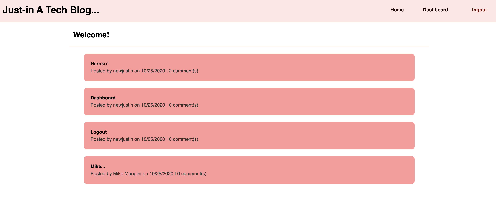

# Tech Blog  
  No license is applicable for this application

  ## Description:  
  This web application/site is a tech blog where users can create an account, blog as they wish, and comment on other posts.
  

  ## Table of Contents:
  * [Installation Instructions](#Installation:)
  * [How to use This Application:](#How-To:)
  * [How to Contibute:](#Contibute:)
  * [License Information:](#License:)
  * [Questions:](#Questions:)
  
  
  ## Installation:  
  There are no special installation instructions, please visit the deployed site...
  https://vast-fjord-84705.herokuapp.com/
  
  
  ## How-To:  
  Go to the website and follow the prompts, have fun, and try to be happy!
  Consider creating a user name and begin bloggin with us
  https://vast-fjord-84705.herokuapp.com/

  
  ## Contribute:  
  Get in touch with me if you wish to contribute

  
  ## License:
  No license is applicable for this application
  
  
  ## Questions:  
  For questions, comments, suggestions, I can be reached at the following  
  https://github.com/hansonjw  
  hansonjw@gmail.com

  ## Requirements:
    GIVEN a CMS-style blog site
    WHEN I visit the site for the first time
    THEN I am presented with the homepage, which includes existing blog posts if any have been posted;
    navigation links for the homepage and the dashboard; and the option to log in

    ***  DONE  ***
    WHEN I click on the homepage option
    THEN I am taken to the homepage

    ***  DONE  ***
    WHEN I click on any other links in the navigation
    THEN I am prompted to either sign up or sign in

    ***  DONE  ***
    WHEN I choose to sign up
    THEN I am prompted to create a username and password

    ***  DONE  ***
    WHEN I click on the sign-up button
    THEN my user credentials are saved and I am logged into the site

    ***  DONE  ***
    WHEN I revisit the site at a later time and choose to sign in
    THEN I am prompted to enter my username and password

    ***  DONE  ***
    WHEN I am signed in to the site
    THEN I see navigation links for the homepage, the dashboard, and the option to log out

    ***  DONE  ***
    WHEN I click on the homepage option in the navigation
    THEN I am taken to the homepage and presented with existing blog posts that include the post title and the date created

    ***  DONE  ***
    WHEN I click on an existing blog post
    THEN I am presented with the post title, contents, post creator’s username, and date created for that post and have the option to leave a comment

    ***  DONE  ***
    WHEN I enter a comment and click on the submit button while signed in
    THEN the comment is saved and the post is updated to display the comment, the comment creator’s username, and the date created

    ***  DONE  ***
    WHEN I click on the dashboard option in the navigation
    THEN I am taken to the dashboard and presented with any blog posts I have already created and the option to add a new blog post

    ***  DONE  ***
    WHEN I click on the button to add a new blog post
    THEN I am prompted to enter both a title and contents for my blog post

    ***  DONE  ***
    WHEN I click on the button to create a new blog post
    THEN the title and contents of my post are saved and I am taken back to an updated dashboard with my new blog post

    *** For future developement... ***
    WHEN I click on one of my existing posts in the dashboard
    THEN I am able to delete or update my post and taken back to an updated dashboard

    UGH!!!...need more time...
    WHEN I click on the logout option in the navigation
    THEN I am signed out of the site

    UGH!!!...need more time...
    WHEN I am idle on the page for more than a set time
    THEN I am automatically signed out of the site 
